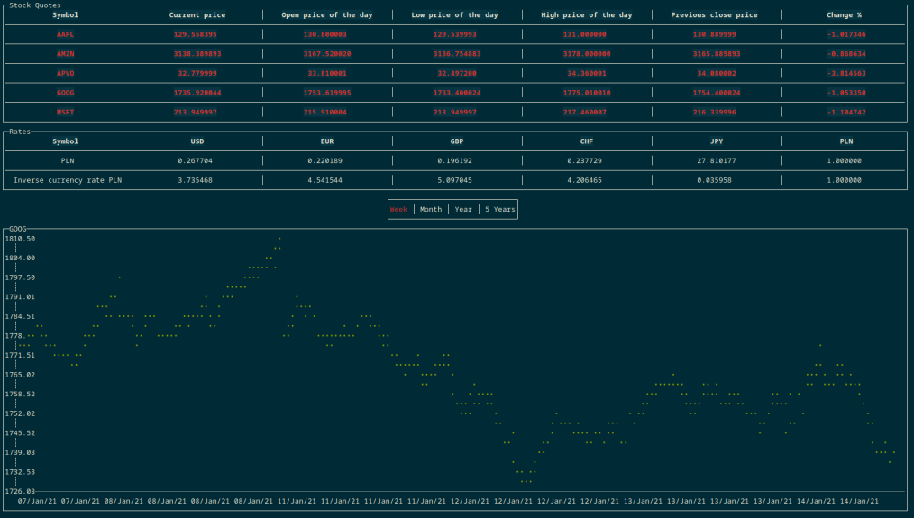

# 

[](https://github.com/bzdanowicz/stock_data/blob/master/LICENSE)
[](https://github.com/bzdanowicz/stock_data/commits/master)


## Table of contents
* [General info](#general-info)
* [Technologies](#technologies)
* [Setup](#setup)
* [Configuration](#configuration)

## General info
Terminal application designed to provide an easy way for users to get up-to-date, basic price information of all the major stocks trading in the US. Data is pulled from the Finnhub API.
	
## Technologies
Project is created with:
* Golang
* [termui](https://github.com/gizak/termui)

## Setup

1. Clone the repository
2. Add API key and stock symbols to `config.json` file
3. Run application with following command:
```
$ go run cmd/main.go
```

## Configuration

The configuration file is located at `~/config.json`
User should provide own API Key (obtained from [Finnhub](https://finnhub.io/)), list of requested stock ticker symbols and base currency to calculate rates.

```
{
    "apiKey": "apiKey",
    "quotes": [
        "AAPL", "MSFT", "AMZN", "GOOG", "APVO"
    ],
    "base": "PLN"
}
```

